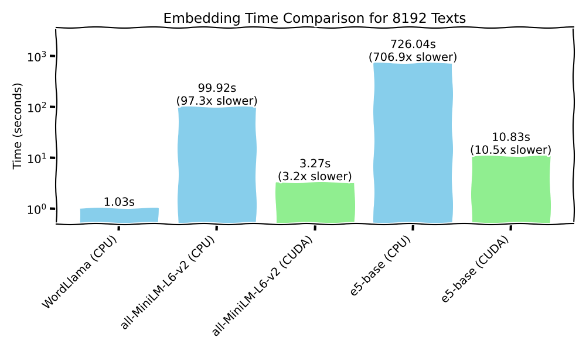

# WordLlama 📝🦙

**WordLlama** is a fast, lightweight NLP toolkit designed for tasks like fuzzy deduplication, similarity computation, ranking, clustering, and semantic text splitting. It operates with minimal inference-time dependencies and is optimized for CPU hardware, making it suitable for deployment in resource-constrained environments.

<p align="center">
  
</p>

## News and Updates 🔥

- **2024-10-04**  Added semantic splitting inference algorithm. See our [technical overview](tutorials/blog/semantic_split/wl_semantic_blog.md).

## Table of Contents

- [Quick Start](#quick-start)
- [Features](#features)
- [What is WordLlama?](#what-is-wordllama)
- [MTEB Results](#mteb-results)
- [How Fast?](#how-fast-zap)
- [Usage](#usage)
  - [Embedding Text](#embedding-text)
  - [Calculating Similarity](#calculating-similarity)
  - [Ranking Documents](#ranking-documents)
  - [Fuzzy Deduplication](#fuzzy-deduplication)
  - [Clustering](#clustering)
  - [Filtering](#filtering)
  - [Top-K Retrieval](#top-k-retrieval)
  - [Semantic Text Splitting](#semantic-text-splitting)
- [Training Notes](#training-notes)
- [Roadmap](#roadmap)
- [Extracting Token Embeddings](#extracting-token-embeddings)
- [Community Projects](#community-projects)
- [Citations](#citations)
- [License](#license)

## Quick Start

Install WordLlama via pip:

```bash
pip install wordllama
```

Load the default 256-dimensional model:

```python
from wordllama import WordLlama

# Load the default WordLlama model
wl = WordLlama.load()

# Calculate similarity between two sentences
similarity_score = wl.similarity("I went to the car", "I went to the pawn shop")
print(similarity_score)  # Output: e.g., 0.0664

# Rank documents based on their similarity to a query
query = "I went to the car"
candidates = ["I went to the park", "I went to the shop", "I went to the truck", "I went to the vehicle"]
ranked_docs = wl.rank(query, candidates)
print(ranked_docs)
# Output:
# [
#   ('I went to the vehicle', 0.7441),
#   ('I went to the truck', 0.2832),
#   ('I went to the shop', 0.1973),
#   ('I went to the park', 0.1510)
# ]
```

## Features

- **Fast Embeddings**: Efficiently generate text embeddings using a simple token lookup with average pooling.
- **Similarity Computation**: Calculate cosine similarity between texts.
- **Ranking**: Rank documents based on their similarity to a query.
- **Fuzzy Deduplication**: Remove duplicate texts based on a similarity threshold.
- **Clustering**: Cluster documents into groups using KMeans clustering.
- **Filtering**: Filter documents based on their similarity to a query.
- **Top-K Retrieval**: Retrieve the top-K most similar documents to a query.
- **Semantic Text Splitting**: Split text into semantically coherent chunks.
- **Binary Embeddings**: Support for binary embeddings with Hamming similarity for even faster computations.
- **Matryoshka Representations**: Truncate embedding dimensions as needed for flexibility.
- **Low Resource Requirements**: Optimized for CPU inference with minimal dependencies.

## What is WordLlama?

WordLlama is a utility for natural language processing (NLP) that recycles components from large language models (LLMs) to create efficient and compact word representations, similar to GloVe, Word2Vec, or FastText.

Starting by extracting the token embedding codebook from state-of-the-art LLMs (e.g., LLaMA 2, LLaMA 3 70B), WordLlama trains a small context-less model within a general-purpose embedding framework. This approach results in a lightweight model that improves on all MTEB benchmarks over traditional word models like GloVe 300d, while being substantially smaller in size (e.g., **16MB default model** at 256 dimensions).

WordLlama's key features include:

1. **Matryoshka Representations**: Allows for truncation of the embedding dimension as needed, providing flexibility in model size and performance.
2. **Low Resource Requirements**: Utilizes a simple token lookup with average pooling, enabling fast operation on CPUs without the need for GPUs.
3. **Binary Embeddings**: Models trained using the straight-through estimator can be packed into small integer arrays for even faster Hamming distance calculations.
4. **Numpy-only Inference**: Lightweight inference pipeline relying solely on NumPy, facilitating easy deployment and integration.

Because of its fast and portable size, WordLlama serves as a versatile tool for exploratory analysis and utility applications, such as LLM output evaluators or preparatory tasks in multi-hop or agentic workflows.

## MTEB Results

The following table presents the performance of WordLlama models compared to other similar models.

| Metric                 | WL64        | WL128        | WL256 (X)    | WL512        | WL1024        | GloVe 300d | Komninos | all-MiniLM-L6-v2 |
|------------------------|-------------|--------------|--------------|--------------|---------------|------------|----------|------------------|
| Clustering             | 30.27       | 32.20        | 33.25        | 33.40        | 33.62         | 27.73      | 26.57    | 42.35            |
| Reranking              | 50.38       | 51.52        | 52.03        | 52.32        | 52.39         | 43.29      | 44.75    | 58.04            |
| Classification         | 53.14       | 56.25        | 58.21        | 59.13        | 59.50         | 57.29      | 57.65    | 63.05            |
| Pair Classification    | 75.80       | 77.59        | 78.22        | 78.50        | 78.60         | 70.92      | 72.94    | 82.37            |
| STS                    | 66.24       | 67.53        | 67.91        | 68.22        | 68.27         | 61.85      | 62.46    | 78.90            |
| CQA DupStack           | 18.76       | 22.54        | 24.12        | 24.59        | 24.83         | 15.47      | 16.79    | 41.32            |
| SummEval               | 30.79       | 29.99        | 30.99        | 29.56        | 29.39         | 28.87      | 30.49    | 30.81            |

**WL64** to **WL1024**: WordLlama models with embedding dimensions ranging from 64 to 1024.

**Note**: The [l2_supercat](https://huggingface.co/dleemiller/word-llama-l2-supercat) is a LLaMA 2 vocabulary model. To train this model, we concatenated codebooks from several models, including LLaMA 2 70B and phi 3 medium, after removing additional special tokens. Because several models have used the LLaMA 2 tokenizer, their codebooks can be concatenated and trained together. The performance of the resulting model is comparable to training the LLaMA 3 70B codebook, while being 4x smaller (32k vs. 128k vocabulary).

### Other Models

- LLaMA 3-based: [l3_supercat](https://huggingface.co/dleemiller/wordllama-l3-supercat)
- [Results](wordllama/RESULTS.md)

## How Fast? :zap:

8k documents from the `ag_news` dataset
- Single core performance (CPU), i9 12th gen, DDR4 3200
- NVIDIA A4500 (GPU) 

<p align="center">
  
</p>

## Usage

### Embedding Text

Load pre-trained embeddings and embed text:

```python
from wordllama import WordLlama

# Load pre-trained embeddings (truncate dimension to 64)
wl = WordLlama.load(trunc_dim=64)

# Embed text
embeddings = wl.embed(["The quick brown fox jumps over the lazy dog", "And all that jazz"])
print(embeddings.shape)  # Output: (2, 64)
```

### Calculating Similarity

Compute the similarity between two texts:

```python
similarity_score = wl.similarity("I went to the car", "I went to the pawn shop")
print(similarity_score)  # Output: e.g., 0.0664
```

### Ranking Documents

Rank documents based on their similarity to a query:

```python
query = "I went to the car"
candidates = ["I went to the park", "I went to the shop", "I went to the truck", "I went to the vehicle"]
ranked_docs = wl.rank(query, candidates)
print(ranked_docs)
# Output:
# [
#   ('I went to the vehicle', 0.7441),
#   ('I went to the truck', 0.2832),
#   ('I went to the shop', 0.1973),
#   ('I went to the park', 0.1510)
# ]
```

### Fuzzy Deduplication

Remove duplicate texts based on a similarity threshold:

```python
deduplicated_docs = wl.deduplicate(candidates, threshold=0.5)
print(deduplicated_docs)
# Output:
# ['I went to the park',
#  'I went to the shop',
#  'I went to the truck']
```

### Clustering

Cluster documents into groups using KMeans clustering:

```python
labels, inertia = wl.cluster(candidates, k=3, max_iterations=100, tolerance=1e-4, n_init=3)
print(labels, inertia)
# Output:
# [2, 0, 1, 1], 0.4150
```

### Filtering

Filter documents based on their similarity to a query:

```python
filtered_docs = wl.filter(query, candidates, threshold=0.3)
print(filtered_docs)
# Output:
# ['I went to the vehicle']
```

### Top-K Retrieval

Retrieve the top-K most similar documents to a query:

```python
top_docs = wl.topk(query, candidates, k=2)
print(top_docs)
# Output:
# ['I went to the vehicle', 'I went to the truck']
```

### Semantic Text Splitting

Split text into semantic chunks:

```python
long_text = "Your very long text goes here... " * 100
chunks = wl.split(long_text, target_size=1536)

print(list(map(len, chunks)))
# Output: [1055, 1055, 1187]
```

Note that the target size is also the maximum size. The `.split()` feature attempts to aggregate sections up to the `target_size`,
but will retain the order of the text as well as sentence and, as much as possible, paragraph structure.
It uses wordllama embeddings to locate more natural indexes to split on. As a result, there will be a range of chunk sizes in the output
up to the target size.

The recommended target size is from 512 to 2048 characters, with the default size at 1536. Chunks that need to be much larger should
probably be batched after splitting, and will often be aggregated from multiple semantic chunks already.

For more information see: [technical overview](tutorials/blog/semantic_split/wl_semantic_blog.md)


## Training Notes

Binary embedding models showed more pronounced improvement at higher dimensions, and either 512 or 1024 dimensions are recommended for binary embeddings.

The L2 Supercat model was trained using a batch size of 512 on a single A100 GPU for 12 hours.

## Roadmap

- **Adding Inference Features**:
  - Semantic text splitting (completed)
- **Additional Example Notebooks**:
  - DSPy evaluators
  - Retrieval-Augmented Generation (RAG) pipelines

## Extracting Token Embeddings

To extract token embeddings from a model, ensure you have agreed to the user agreement and logged in using the Hugging Face CLI (for LLaMA models). You can then use the following snippet:

```python
from wordllama.extract.extract_safetensors import extract_safetensors

# Extract embeddings for the specified configuration
extract_safetensors("llama3_70B", "path/to/saved/model-0001-of-00XX.safetensors")
```

**Hint**: Embeddings are usually in the first `safetensors` file, but not always. Sometimes there is a manifest; sometimes you have to inspect and figure it out.

For training, use the scripts in the GitHub repository. You have to add a configuration file (copy/modify an existing one into the folder).

```bash
pip install wordllama[train]
python train.py train --config your_new_config
# (Training process begins)
python train.py save --config your_new_config --checkpoint ... --outdir /path/to/weights/
# (Saves one model per Matryoshka dimension)
```

## Community Projects

- [Gradio Demo HF Space](https://huggingface.co/spaces/1littlecoder/wordllama)
- [CPU-ish RAG](https://github.com/dinhanhx/cpu-ish-rag)

## Citations

If you use WordLlama in your research or project, please consider citing it as follows:

```bibtex
@software{miller2024wordllama,
  author = {Miller, D. Lee},
  title = {WordLlama: Recycled Token Embeddings from Large Language Models},
  year = {2024},
  url = {https://github.com/dleemiller/wordllama},
  version = {0.2.6}
}
```

## License

This project is licensed under the MIT License.
