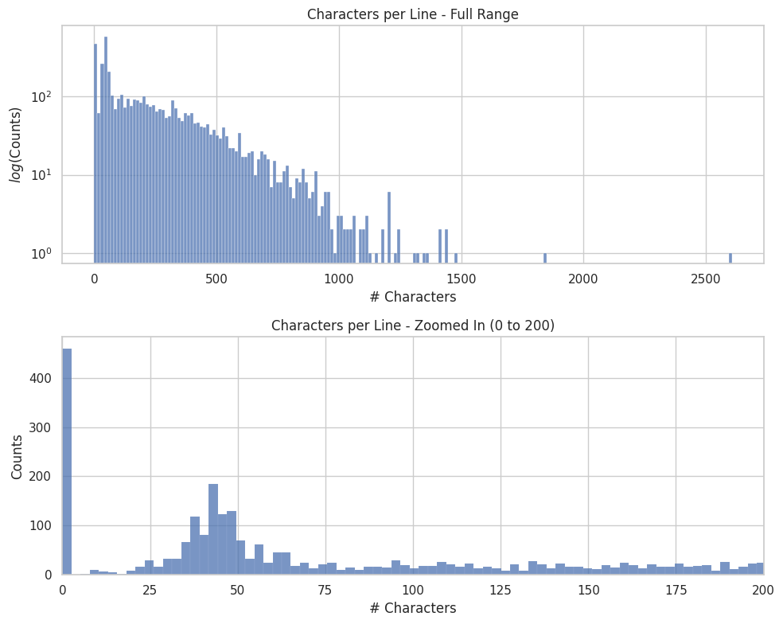
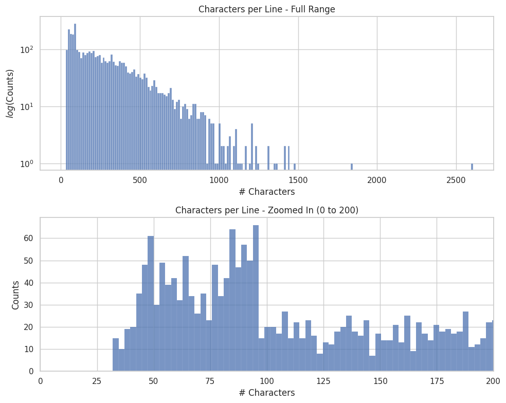
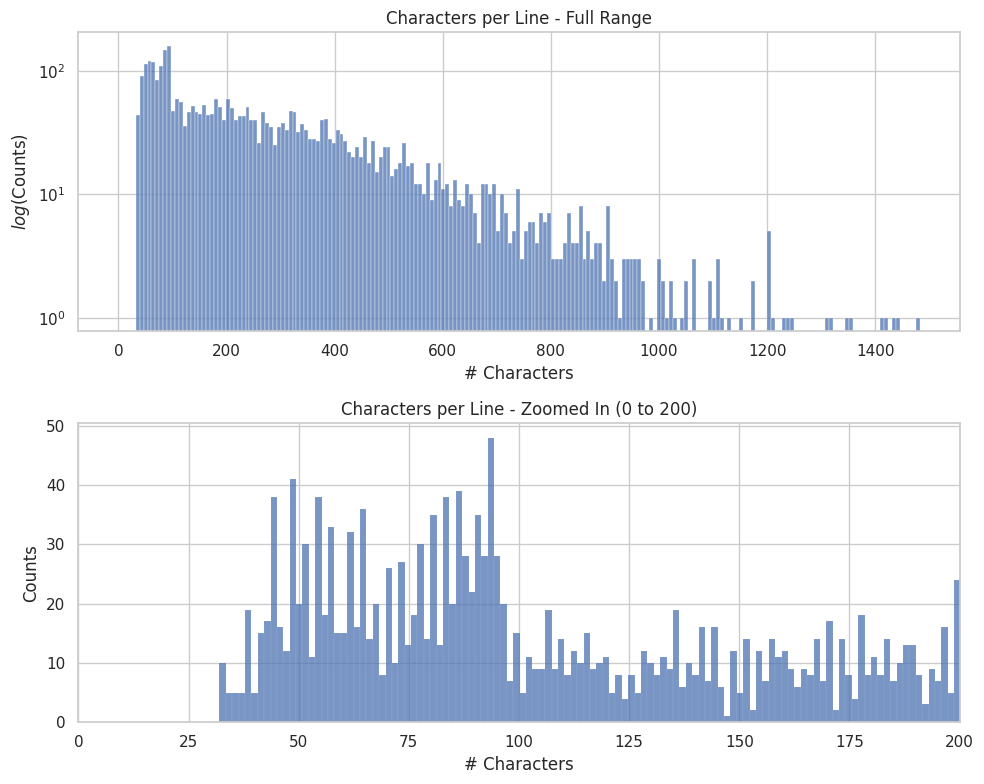
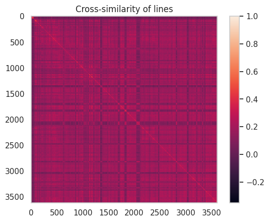
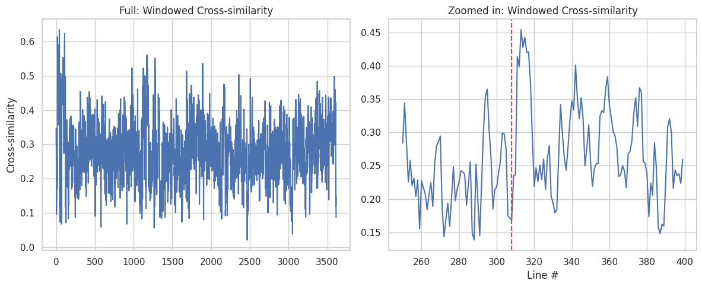
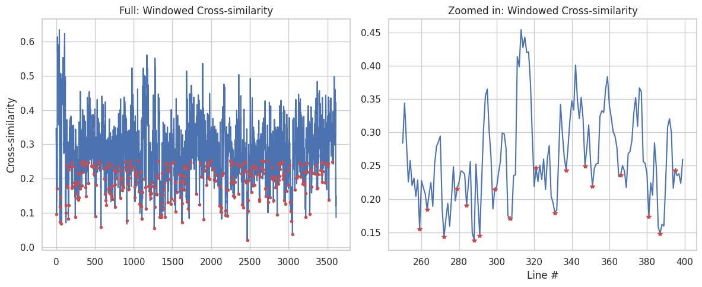
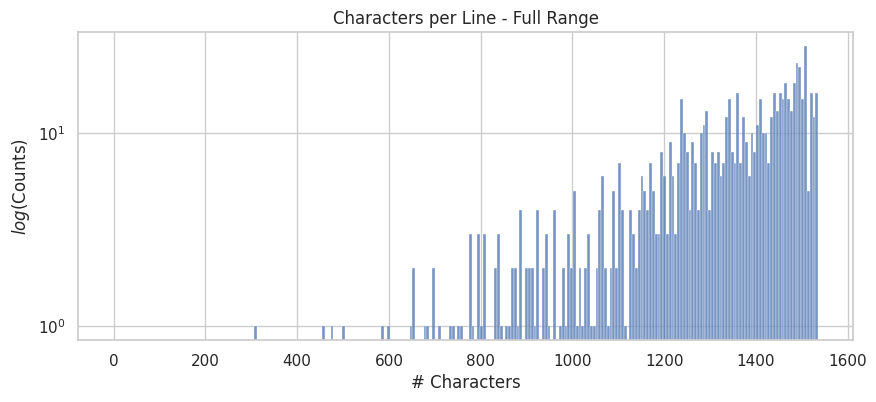

# Semantic Splitting with WordLlama
2024-10-03

## TLDR

Split text like "The Lord of the Rings" in ~750ms, incorporating semantic similarity.

## Why spend so much effort on splitting?

When splitting/chunking text for Retrieval-Augmented Generation (RAG) applications, the goal is to avoid breaking apart complete ideas or topics. Here's a progression of standard splitting methods:

1. Fixed character count: Splits on a set number of characters, even breaking words.
2. Word-aware splitting: Forms splits of approximate character counts without breaking words.
3. Sentence-level splitting: Breaks only at sentence boundaries, sacrificing some consistency in chunk sizes.
4. Paragraph-level splitting: Maintains paragraph integrity but may result in highly variable chunk sizes.

These methods don't require language modeling, but they lack semantic awareness. More advanced techniques using language models can provide better semantic coherence but typically at a significant computational cost and latency. And, although semantic splitting is conceptually simple, it still involves multiple steps to refine a quality algorithm.

WordLlama is a good platform for accomplishing this, since it can incorporate basic semantic information into the chunking process, without adding significant computational requirements. Here, we develop a recipe for semantic splitting with WordLlama using an intuitive process. 

## Target texts

We focus on chunking for information retrieval and RAG applications. For these use cases, text chunks typically consist of 256-2048 tokens. Input texts can vary widely, including:

- Long-form articles or blog posts
- Academic papers or research reports
- Books or book chapters
- Legal documents or contracts
- Technical documentation or manuals
- Transcripts from interviews, speeches, or conversations

The challenge lies in maintaining semantic coherence across diverse text types and lengths while producing consistently sized chunks.

## Method Overview

Our process involves three main steps:

1. `split`: Divide the original text into small chunks.
2. `embed`: Generate embeddings for each chunk.
3. `reconstruct`: Combine chunks based on similarity information up to target sizes

The algorithm aims to:

1. Maximize information continuity, keeping related concepts and ideas together
2. Produce consistent chunk sizes
3. Maintain high performance with low computational requirements

### Split

The initial split divides the text into smaller units, typically at the paragraph level and at the sentence level when paragraphs exceed the target sizes. This step ensures that the basic grammatical structures remain intact, which is a simple way to preserve semantic information without language models.

### Embed

Each chunk is embedded using WordLlama. It offers a good balance between semantic representation and computational efficiency.

### Reconstruct

The reconstruction step checks the similarity between adjacent chunks using their embeddings. It uses this information to make better decisions about where to place chunk boundaries:

- Keep semantically similar content together
- Avoid splitting in the middle of ideas
- Form chunks of consistent sizes

Using WordLlama embedding with efficient algorithms, this process can handle large texts quickly, making it suitable for various applications and computational environments.

### Load The Lord of the Rings Text


```python
import chardet

filename = "lotr_fellowship.txt"
with open(filename, "rb") as file:
    raw_data = file.read()
    result = chardet.detect(raw_data)
    encoding = result['encoding']

with open(filename, "r", encoding=encoding) as file:
    text = file.read()

print(text[0:300])
```

    J. R. R. Tolkien — The Lord Of The Rings. (1/4)
    -----------------------------------------------
    
    
         THE LORD OF THE RINGS
    
                  by
    
         J. R. R. TOLKIEN
    
    
    
     Part 1: The Fellowship of the Ring
     Part 2: The Two Towers
     Part 3: The Return of the King
    
    
    _Complete with Index and Full Appendi


## Step 1: Split

First let's see what we get from a simple `splitlines()`

### Plot Helper


```python
import matplotlib.pyplot as plt
import seaborn as sns

def plot_chars(chars_per_line):
    sns.set(style="whitegrid")
    fig, axes = plt.subplots(2, 1, figsize=(10, 8))
    
    # First plot: full range
    sns.histplot(chars_per_line, bins=200, ax=axes[0], kde=False)
    axes[0].set_title("Characters per Line - Full Range")
    axes[0].set_xlabel("# Characters")
    axes[0].set_ylabel("$log($Counts$)$")
    axes[0].semilogy(True)
    
    # Second plot: zoomed-in range
    sns.histplot(chars_per_line, bins=1000, ax=axes[1], kde=False)
    axes[1].set_title("Characters per Line - Zoomed In (0 to 100)")
    axes[1].set_xlabel("# Characters")
    axes[1].set_ylabel("Counts")
    axes[1].set_xlim((0, 200))
    
    plt.tight_layout()
    plt.show()
```


```python
# Split the text into lines
lines = text.splitlines()

# Calculate the number of characters per line
chars_per_line = list(map(len, lines))

plot_chars(chars_per_line)
```


    

    


Here we can see a bunch of small fragments with close to zero size. Additionally, there are some smaller segments below 50 characters. While most of the chunks are fewer than 1k characters, there are a few larger ones as well. The chunks that are a few characters or less are not likely to carry much semantic information and are disproportionate compared to most of the other segments.

### Constrained Coalesce

I started with `constrained_batches()` from `more-itertools`, which is a nice batching algorithm for gathering texts. However, it is a "greedy" algorithm that combines from left to right until a batch would exceed a given constraint by batching with the next item. This can leave the last batch as a small fragment compared to the constraint size, and is very likely to sandwich the fragments between larger sections.

To address this, I added a similar idea, but with "coalesce" style combination. This does recursive neighbor to neighbor batching up to the constraint size, so that more consistent batch sizes are produced. The result is that the combined segments do not typically hit the max size, but also the smallest fragments are not as small.


```python
import string
from wordllama.algorithms.splitter import constrained_coalesce, constrained_batches, reverse_merge


letters = list(string.ascii_lowercase)

# using constrained coalesce
constrained_coalesce(letters, max_size=5, separator="")
```


    ['abcd', 'efgh', 'ijkl', 'mnop', 'qrst', 'uvwx', 'yz']


```python
# using constrained batches
list(map("".join, constrained_batches(letters, max_size=5)))
```


    ['abcde', 'fghij', 'klmno', 'pqrst', 'uvwxy', 'z']


In the coalesce algorithm, we prioritize consistent chunk sizes, which is more beneficial for embedding comparisons. We also add a `reverse_merge` operation which more forcibly merges anything below a certain number of characters `n`
with the previous string in the list.


```python
# Split the text into lines
lines = text.splitlines()
lines = constrained_coalesce(lines, max_size=96, separator="\n")
lines = reverse_merge(lines, n=32, separator="\n")

# Calculate the number of characters per line
chars_per_line = list(map(len, lines))

plot_chars(chars_per_line)
```


    

    


This is better. Let's take care of the larger segments.

We need to import a function to do sentence splitting. First we'll split the large paragraphs and then recombine them back to a smaller size. If we have to split a paragraph, it's probably best to keep localized sections of it together with other sentences in the split.

We'll need to have a target size. 1536 chars is a good number for 512 token width models. We also reverse merge to clean up before moving on.


```python
from itertools import chain
from typing import List
from wordllama.algorithms.splitter import split_sentences

def flatten(nested_list: List[List]) -> List:
    return list(chain.from_iterable(nested_list))

def constrained_split(
    text: str,
    target_size: int,
    separator: str = " ",
) -> List[str]:
    sentences = split_sentences(text)
    sentences = constrained_coalesce(sentences, target_size, separator=separator)
    sentences = reverse_merge(sentences, n=32, separator=" ")
    return sentences
```


```python
TARGET_SIZE = 1536
MAX_CHUNK = 512

# Split the text into lines
lines = text.splitlines()
lines = constrained_coalesce(lines, max_size=96, separator="\n")
lines = reverse_merge(lines, n=32, separator="\n")

results = []
# break chunks above target size into
# sentences and combine into medium sized chunks
for line in lines:
    if len(line) > TARGET_SIZE:
        sentence_chunks = constrained_split(line, MAX_CHUNK, separator=" ")
    else:
        sentence_chunks = [line]
    results.extend(sentence_chunks)
lines = results


# Calculate the number of characters per line
chars_per_line = list(map(len, lines))

plot_chars(chars_per_line)
```


    

    


Now we have a more reasonable starting point for doing semantic splitting. Let's use wordllama to embed the segments into vectors, and compute similarity for all the segments.

## Step 2: Embedding


```python
from wordllama import WordLlama

wl = WordLlama.load()

# calculate the cross-similarity
embeddings = wl.embed(lines, norm=True)
xsim = wl.vector_similarity(embeddings, embeddings)

plt.imshow(xsim)
plt.grid(False)
plt.colorbar()
plt.title("Cross-similarity of lines")
```


    Text(0.5, 1.0, 'Cross-similarity of lines')


    

    


Here's where we can see how wordllama can help. As we traverse the diagonal, we can identify blocks of similar texts. The very small block in the upper left corner is the table of contents.

A windowed average should help with finding these blocks. The average should be high when the window spans a region of high similarity, and low between between similarity blocks. Instead of computing the full cross similarity, it makes more sense to compare localized text segments using a sliding window.


```python
from wordllama.algorithms.find_local_minima import windowed_cross_similarity

xsim = windowed_cross_similarity(embeddings, window_size=5)


fig, (ax1, ax2) = plt.subplots(1, 2, figsize=(12, 5))

im1 = ax1.plot(xsim)
ax1.set_title('Full: Windowed Cross-similarity')
ax1.set_ylabel("Cross-similarity")

ax2.plot(range(250, 400), xsim[250:400], 'b-')
ax2.set_title('Zoomed in: Windowed Cross-similarity')
ax2.set_xlabel('Line #')
ax2.axvline(308, ls="--", color="r")

plt.tight_layout()
plt.show()

```


    

    


With the size of our segments, even 10-20 segments is a decent chunk size. Here we can zoom in on the minimum around the **dashed red line index (308)**. 


```python
print("\n".join([lines[i] if i != 308 else f">>>>>>>>>>>>>{lines[i]}<<<<<<<<<<<<<" for i in range(305, 310)]))
```

         'Some people!' exclaimed Frodo. 'You mean Otho and Lobelia. How abominable! I would give them Bag End and everything else, if I could get Bilbo back and go off tramping in the country with him. I love the Shire. But I begin to wish, somehow, that I had gone too. I wonder if I shall ever see him again.'
         'So do I,' said Gandalf. 'And I wonder many other things. Good-bye now! Take care of yourself! Look out for me, especially at unlikely times! Good-bye!'
         Frodo saw him to the door. He gave a final wave of his hand, and walked off at a surprising pace; but Frodo thought the old wizard looked unusually bent, almost as if he was carrying a great weight. The evening was closing in, and his cloaked figure quickly vanished into the twilight. Frodo did not see him again for a long time.
    >>>>>>>>>>>>>
    
                               _Chapter 2_
                The Shadow of the Past
    <<<<<<<<<<<<<
         The talk did not die down in nine or even ninety-nine days. The second disappearance of Mr. Bilbo Baggins was discussed in Hobbiton, and indeed all over the Shire, for a year and a day, and was remembered much longer than that. It became a fireside-story for young hobbits; and eventually Mad Baggins, who used to vanish with a bang and a flash and reappear with bags of jewels and gold, became a favourite character of legend and lived on long after all the true events were forgotten.


### Avast, a chapter break!

Savitzky-Golay, time do your thing. It's a smoothing filter that fits an Nth-degree polynomial over a small window of points. Therefore, it does not have phase shift, and it provides easily calculable derivatives with low sensitivity to noise. This filter is the basis of our `find_local_minima` algorithm, which looks for the roots of the first derivative (mins and maxes), and checks the sign of the second derivative to determine minima. It then interpolates between points to determine which index to split at.

The process goes like this:
1. Apply the Savitzky-Golay filter to calculate the first and second derivatives
2. Identify roots of the first derivative to find mins/maxes
3. Use the sign of the second derivative to distinguish minima
4. Interpolate  and round to find the best index for splitting

Last, we screen off everything above a percentile (e.g., 0.4), so we're just keeping minima at globally low similarity points. This ensures that we're only splitting at the most significant semantic boundaries.


```python
import numpy as np
from wordllama.algorithms.find_local_minima import find_local_minima

a,b = (250, 400)

results = find_local_minima(xsim, poly_order=2, window_size=3)

# filter below median
idx = np.where(results[1] < np.quantile(xsim, 0.4))

x = results[0][idx]
y = results[1][idx]

fig, (ax1, ax2) = plt.subplots(1, 2, figsize=(12, 5))

ax1.plot(xsim)
ax1.plot(x, y, "r.")
ax1.set_title('Full: Windowed Cross-similarity')
ax1.set_ylabel("Cross-similarity")

ax2.plot(range(a,b), xsim[a:b], 'b-')
zoom, = np.where((x < b) & (x >= a))
ax2.plot(x[zoom], y[zoom], "r*")

ax2.set_title('Zoomed in: Windowed Cross-similarity')
ax2.set_xlabel('Line #')

plt.tight_layout()
plt.show()

```


    

    


Well that was fun. Now all that's left is to bring the sections back up to our target size.

Here, we can use batching functions we discussed previously, and take regions in between our semantic split points.

## Step 3: Reconstruction


```python
# reconstruct using the minima as boundaries for coalesce
# this ensures that any semantic boundaries are respected
chunks = []
start = 0
for end in x + [len(lines)]:
    chunk = constrained_coalesce(lines[start:end], TARGET_SIZE)
    chunks.extend(chunk)
    start = end

lines = list(map("".join, constrained_batches(lines, max_size=TARGET_SIZE, strict=False)))

# Calculate the number of characters per line
chars_per_line = list(map(len, lines))

# plotting
sns.set(style="whitegrid")
fig, ax = plt.subplots(1, 1, figsize=(10, 4))

sns.histplot(chars_per_line, bins=200, ax=ax, kde=False)
ax.set_title("Characters per Line - Full Range")
ax.set_xlabel("# Characters")
ax.set_ylabel("$log($Counts$)$")
ax.semilogy(True)
```


    [<matplotlib.lines.Line2D at 0x7fd4e06d8590>]


    

    


### Visualize


```python
from IPython.display import Markdown, display

def display_strings(string_list, offset=0):
    """
    Convert a list of strings into a markdown table and display it in a Jupyter notebook.
    
    Parameters:
    - string_list (list): The list of strings to display
    
    Returns:
    - None (displays the table in the notebook)
    """
    # Create the table header
    table = "| Index | Text |\n|-------|------|\n"
    
    # Add each string to the table
    for i, text in enumerate(string_list):
        row = f"| {i + offset} | {text[:600]}{'...' if len(text) > 600 else ''} |\n"
        table += row
    
    # Display the table
    display(Markdown(table))

display_strings(lines[400:406], offset=400)
```


| Index | Text |
|-------|------|
| 400 |      The hobbits grew very weary. They advanced slowly, for they had to pick their way through a pathless country, encumbered by fallen trees and tumbled rocks. As long as they could they avoided climbing for Frodo's sake, and because it was in fact difficult to find any way up out of the narrow dales. They had been two days in this country when the weather turned wet. The wind began to blow steadily out of the West and pour the water of the distant seas on the dark heads of the hills in fine drenching rain. By nightfall they were all soaked, and their camp was cheerless, for they could not ge... |
| 401 |      That night they camped on a stony shelf with a rock-wall behind them, in which there was a shallow cave, a mere scoop in the cliff. Frodo was restless. The cold and wet had made his wound more painful than ever, and the ache and sense of deadly chill took away all sleep. He lay tossing and turning and listening fearfully to the stealthy night-noises: wind in chinks of rock, water dripping, a crack, the sudden rattling fall of a loosened stone. He felt that black shapes were advancing to smother him; but when he sat up he saw nothing but the back of Strider sitting hunched up, smoking his ... |
| 402 |      When he returned he was not reassuring. 'We have come too far to the north,' he said, 'and we must find some way to turn back southwards again. If we keep on as we are going we shall get up into the Ettendales far north of Rivendell. That is troll-country, and little known to me. We could perhaps find our way through and come round to Rivendell from the north; but it would take too long, for I do not know the way, and our food would not last. So somehow or other we must find the Ford of Bruinen.'     The rest of that day they spent scrambling over rocky ground. They found a passage betwee... |
| 403 |      They decided to attempt the climb, but it proved very difficult. Before long Frodo was obliged to dismount and struggle along on foot. Even so they often despaired of getting their pony up, or indeed of finding a path for themselves, burdened as they were. The light was nearly gone, and they were all exhausted, when at last they reached the top. They had climbed on to a narrow saddle between two higher points, and the land fell steeply away again, only a short distance ahead. Frodo threw himself down, and lay on the ground shivering. His left arm was lifeless, and his side and shoulder fe... |
| 404 |      'Frodo has been touched by the weapons of the Enemy,' said Strider, 'and there is some poison or evil at work that is beyond my skill to drive out. But do not give up hope, Sam!'     Night was cold up on the high ridge. They lit a small fire down under the gnarled roots of an old pine, that hung over a shallow pit: it looked as if stone had once been quarried there. They sat huddled together. The wind blew chill through the pass, and they heard the tree-tops lower down moaning and sighing. Frodo lay half in a dream, imagining that endless dark wings were sweeping by above him, and that on... |
| 405 |      'We must make for the Road again,' he said. 'We cannot hope to find a path through these hills. Whatever danger may beset it, the Road is our only way to the Ford.'     As soon as they had eaten they set out again. They climbed slowly down the southern side of the ridge; but the way was much easier than they had expected, for the slope was far less steep on this side, and before long Frodo was able to ride again. Bill Ferny's poor old pony was developing an unexpected talent for picking out a path, and for sparing its rider as many jolts as possible. The spirits of the party rose again. E... |


# wl.split() the algorithm

Put all of that into an algorithm, and we have built a splitter that works efficiently.

Thanks for reading!


```python
%%time

results = wl.split(
        text,
        target_size=1536,
        window_size = 3,
        poly_order = 2,
        savgol_window = 3,
)

print(f"Length of text: {len(text):.2e} chars\n# of chunks: {len(results)}\n\nProcessing time:")
```

    Length of text: 1.02e+06 chars
    # of chunks: 784
    
    Processing time:
    CPU times: user 1.31 s, sys: 111 ms, total: 1.43 s
    Wall time: 677 ms


```python

```
