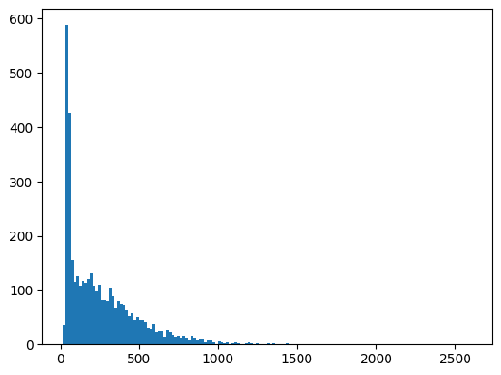
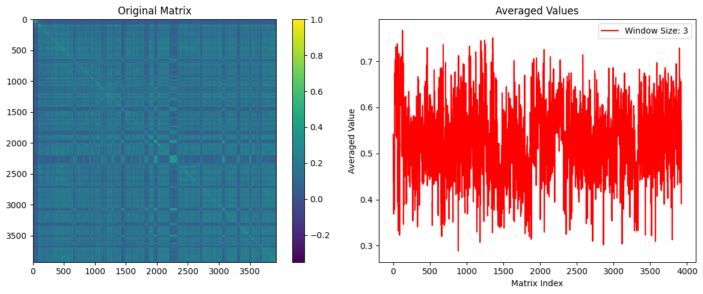
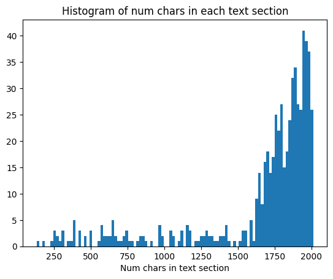

# Semantic Splitting

Here's a semanting splitting concept with WordLlama.

We develop an algorithm for semanting splitting using cross-similarity with savitzky-golay smoothing.

## The process we define goes as follows:
- Load the raw text
- Split the text on newlines
- Join small segments and split large ones to create more consistent small chunks
- Embed the chunks
- Compute the cross similarity matrix
- Compute a windowed average along the diagonal
- Find local minima using a savitzky-golay filter
- Reconstruct text chunks
- Clean up small text chunks


```python
from wordllama import WordLlama

wl = WordLlama.load()
```

Load the text (Lord of the Rings - The Fellowship of the Rings)


```python
import chardet

with open("/home/lee/Downloads/lotr_fellowship.txt", "rb") as file:
    raw_data = file.read()
    result = chardet.detect(raw_data)
    encoding = result['encoding']

print(f"Detected encoding: {encoding}")

with open("/home/lee/Downloads/lotr_fellowship.txt", "r", encoding=encoding) as file:
    lotr_txt = file.read()
```

    Detected encoding: Windows-1252


## Cleaning

Newlines are a good starting place for semantic splitting. Ideally, we want to preserve this natural split, while also trying to work the text into a more consistent chunk size.

Sometimes, we have multiple newlines in a row, or short sections between newlines (eg. title pages, etc). We want to gradually batch these up to balanced larger segments. After that we want to consider chunks that are longer than our target, and reduce those into sentences before batching them back together.

Our goal is to maintain natural semantic information in the initial splitting, while also breaking down text into more consistent sizes to help improve consistency in window functions we will use to produce final chunk sizes.


```python
import matplotlib.pyplot as plt
from itertools import chain
from wordllama.algorithms import split_sentences, constrained_coalesce

def flatten(nested_list):
    return chain.from_iterable(nested_list)

TARGET_SIZE = 64 # small strings of 
FINAL_TARGET_SIZE = 2048

def constrained_split(x, target_size=FINAL_TARGET_SIZE):
    """
    Split sentence level, then coalesce
    """
    x = split_sentences(x)
    batches = constrained_coalesce(x, target_size, separator=" ")
    return list(map("".join, batches))

# first split on newlines, recombine small segments
lotr_lines = lotr_txt.splitlines()

# coalesce splits to target size
# this increases fragmented strings to granular semantically meaningful sizes
lotr_lines = constrained_coalesce(lotr_lines, TARGET_SIZE, separator="\n")

# break down large chunks above final target size
# retain paragraphs, except if too big, then break on sentences
lotr_lines = [constrained_split(x) if len(x) > FINAL_TARGET_SIZE else [x] for x in lotr_lines]

# flatten nested lists
lotr_lines = list(flatten(lotr_lines))

# remove empties and pure whitespace
lotr_lines = list(filter(lambda x: len(x.strip()) > 0, lotr_lines))

# plot the distribution of splits
lotr_chars = list(map(len, lotr_lines))
bins = plt.hist(lotr_chars, bins=150)
```


    

    


## Embed the paragraphs

Use the wordllama embedding method to embed the list of strings. We are using the default 256-dim model.


```python
lotr_vec = wl.embed(lotr_lines)
lotr_vec.shape
```


    (3931, 256)


# Compute the cross similarity

We use the vector_similarity method to compute the vector similarity between each line and every other line in the corpus. This shows banding of similar regions of text that forms the basis of our extraction.


```python
sim = wl.vector_similarity(lotr_vec, lotr_vec)
```


```python
import numpy as np
from wordllama.algorithms.find_local_minima import window_average
import matplotlib.pyplot as plt

# Apply window averaging
window_size = 3
averaged_values = window_average(sim, window_size)
print(np.std(sim))

# Plotting
fig, (ax1, ax2) = plt.subplots(1, 2, figsize=(12, 5))

im1 = ax1.imshow(sim, cmap='viridis')
ax1.set_title('Original Matrix')
plt.colorbar(im1, ax=ax1)

ax2.plot(averaged_values, 'r-', label=f'Window Size: {window_size}')
ax2.set_title('Averaged Values')
ax2.legend()
ax2.set_xlabel('Matrix Index')
ax2.set_ylabel('Averaged Value')

plt.tight_layout()
plt.show()

```

    0.124529295


    

    


## Signal processing

This part is a bit of art and practicality. Clearly the plot shows a lot of reasonable candidates for splitting. We need to interpret it in such a way that balances text length with the semantic pattern from the text. Our goal is not to only split based on the embedding signals, but also find a reasonable balance in the text length as well. Most of our text chunks should be of a consistent size, utilizing the minima to provide some of the information for segmentation.

Savitzky-Golay is a good choice for processing the signal, because it has zero phase shift and polynomial smoothing. Additionally, it can produce derivatives so that we can find the local minima which we will use for locating splitting indexes.


```python
from wordllama.algorithms.find_local_minima import find_local_minima
```

## Reconstruction

Now we have a window size that we can use to balance the tension between chunk size consistency and semantic segmentation. Larger window sizes perform more smoothing and filter out smaller signals, so more importance is given toward consistent sizes. Smaller window sizes capture finer fluctuations and give more importance to splitting on semantic signals.

We add indexes at 0 and the end and zip the shifted lists of roots. Now we have pairs if indexes where we can split the text.


```python
window_size = 3

sim_avg = window_average(sim, window_size)
x = np.arange(len(sim_avg))
roots, _ = find_local_minima(x, sim_avg, poly_order=2, window_size=9, dec=1)
sem_split = np.round(roots).astype(int).tolist()
slices = list(zip([0] + sem_split, sem_split + [len(lotr_lines)]))

text_span = []
for s in slices:
    a, b = s
    text = constrained_coalesce(lotr_lines[s[0]:s[1]], FINAL_TARGET_SIZE)
    text_span.extend(text)

# clean up small sections
text_span = constrained_coalesce(text_span, FINAL_TARGET_SIZE)
print(f"Number of semantic splits: {len(slices)}")
print(f"Total number of text spans: {len(text_span)}")
print(f"Original number of strings: {len(lotr_lines)}")
print(f"Semantic split rate: {100 * len(slices)/len(text_span):.1f}%")
text_chars = list(map(len, text_span))

h = plt.hist(text_chars, bins=100)
plt.xlabel("Num chars in text section")
t = plt.title("Histogram of num chars in each text section")
```

    Number of semantic splits: 593
    Total number of text spans: 680
    Original number of strings: 3931
    Semantic split rate: 87.2%


    

    


## View splits


```python
import html
import re

def escape_markdown(text):
    text = html.unescape(text)
    text = re.sub(r'([-*_])\1{2,}', lambda m: '\\' + m.group(0), text)
    return text

def format_text_for_markdown(text):
    """Format text, preserving newlines and spaces."""
    text = html.escape(text)
    # Then escape markdown
    text = escape_markdown(text)
    # Preserve newlines and spaces
    lines = text.split('\n')
    formatted_lines = ['    ' + line if line.strip() else '' for line in lines]
    return '\n'.join(formatted_lines)

def display_strings_markdown_preserved(strings):
    """
    Display a list of strings in a GitHub-friendly markdown format, preserving formatting.
    
    Args:
    strings (list): A list of strings to display.
    """
    markdown_content = "# Text Spans\n\n"
    for i, string in enumerate(strings, 1):
        formatted_string = format_text_for_markdown(string)
        markdown_content += f"## Split {i}\n\n{formatted_string}\n\n"
    
    from IPython.display import Markdown, display
    display(Markdown(markdown_content))

# Example usage
display_strings_markdown_preserved(text_span[0:20])
```


# Text Spans

## Split 1

    J. R. R. Tolkien — The Lord Of The Rings. (1/4)
    \-----------------------------------------------


         THE LORD OF THE RINGS

                  by

         J. R. R. TOLKIEN


     Part 1: The Fellowship of the Ring
     Part 2: The Two Towers
     Part 3: The Return of the King


    _Complete with Index and Full Appendices_


              _Three Rings for the Elven-kings under the sky,
                   Seven for the Dwarf-lords in their halls of stone,
                Nine for Mortal Men doomed to die,
                  One for the Dark Lord on his dark throne
               In the Land of Mordor where the Shadows lie.
                   One Ring to rule them all, One Ring to find them,
                   One Ring to bring them all and in the darkness bind them
               In the Land of Mordor where the Shadows lie._


    			CONTENTS

     FOREWORD
     PROLOGUE

     1. Concerning Hobbits

## Split 2

     2. Concerning Pipe-weed
     3. Of the Ordering of the Shire
     4. Of the Finding of the Ring

     Note on the Shire records


    	THE FELLOWSHIP OF THE RING

     Book I

     Chapter 1 A Long-expected Party
     Chapter 2 The Shadow of the Past
     Chapter 3 Three is Company
     Chapter 4 A Short Cut to Mushrooms
     Chapter 5 A Conspiracy Unmasked
     Chapter 6 The Old Forest
     Chapter 7 In the House of Tom Bombadil
     Chapter 8 Fog on the Barrow-Downs
     Chapter 9 At the Sign of The Prancing Pony
     Chapter 10 Strider
     Chapter 11 A Knife in the Dark
     Chapter 12 Flight to the Ford

     Book II

     Chapter 1 Many Meetings
     Chapter 2 The Council of Elrond
     Chapter 3 The Ring Goes South
     Chapter 4 A Journey in the Dark
     Chapter 5 The Bridge of Khazad-dûm
     Chapter 6 Lothlórien
     Chapter 7 The Mirror of Galadriel
     Chapter 8 Farewell to Lórien
     Chapter 9 The Great River
     Chapter 10 The Breaking of the Fellowship


    	THE TWO TOWERS

     Book III

     Chapter 1 The Departure of Boromir
     Chapter 2 The Riders of Rohan
     Chapter 3 The Uruk-Hai
     Chapter 4 Treebeard
     Chapter 5 The White Rider
     Chapter 6 The King of the Golden Hall
     Chapter 7 Helm's Deep
     Chapter 8 The Road to Isengard
     Chapter 9 Flotsam and Jetsam
     Chapter 10 The Voice of Saruman
     Chapter 11 The Palantýr

     Book IV

     Chapter 1 The Taming of Sméagol
     Chapter 2 The Passage of the Marshes
     Chapter 3 The Black Gate is Closed

## Split 3

     Chapter 4 Of Herbs and Stewed Rabbit
     Chapter 5 The Window on the West
     Chapter 6 The Forbidden Pool
     Chapter 7 Journey to the Cross-roads
     Chapter 8 The Stairs of Cirith Ungol
     Chapter 9 Shelob's Lair
     Chapter 10 The Choices of Master Samwise


    	THE RETURN OF THE KING

     Book V

     Chapter 1 Minas Tirith
     Chapter 2 The Passing of the Grey Company
     Chapter 3 The Muster of Rohan
     Chapter 4 The Siege of Gondor
     Chapter 5 The Ride of the Rohirrim
     Chapter 6 The Battle of the Pelennor Fields
     Chapter 7 The Pyre of Denethor
     Chapter 8 The Houses of Healing
     Chapter 9 The Last Debate
     Chapter 10 The Black Gate Opens

     Book VI

     Chapter 1 The Tower of Cirith Ungol
     Chapter 2 The Land of Shadow
     Chapter 3 Mount Doom
     Chapter 4 The Field of Cormallen
     Chapter 5 The Steward and the King
     Chapter 6 Many Partings
     Chapter 7 Homeward Bound
     Chapter 8 The Scouring of the Shire
     Chapter 9 The Grey Havens

     APPENDICES

     A ANNALS OF THE KINGS AND RULERS
      I The Númenorean Kings
     (I) Númenor
     (II) The Realms In Exile
     (III) Eriador, Arnor, and The Heirs Of Isildur
     (IV) Gondor and The Heirs Of Anñrion
     (V)  Here Follows a Part of The Tale of Aragorn and Arwen

     II THE HOUSE  OF EORL

     III DURIN'S FOLK

     Here follows one of the last notes in the Red Book


     B THE TALE OF YEARS (CHRONOLOGY OF THE WESTLANDS)

     The Second Age
     The Third Age

     C FAMILY TREES

     D CALENDARS

     SHIRE CALENDAR FOR USE IN ALL YEARS
     THE CALENDARS

     E WRITING AND SPELLING
     	I Pronunciation of Words and Names
     	II Writing

     F

## Split 4

     I The Languages and Peoples of The Third Age
     II  On Translation


     INDEXES

      I Songs and Verses
     II Persons, Beasts and Monsters
    III Places
    IV Things


    \----------------------------------------------


    FOREWORD

    This tale grew in the telling, until it became a history of the Great War of the Ring and included many glimpses of the yet more ancient history that preceded it. It was begun soon after _The Hobbit_ was written and before its publication in 1937; but I did not go on with this sequel, for I wished first to complete and set in order the mythology and legends of the Elder Days, which had then been taking shape for some years. I desired to do this for my own satisfaction, and I had little hope that other people would be interested in this work, especially since it was primarily linguistic in inspiration and was begun in order to provide the necessary background of 'history' for Elvish tongues.

## Split 5

         When those whose advice and opinion I sought corrected _little hope_ to _no hope,_ I went back to the sequel, encouraged by requests from readers for more information concerning hobbits and their adventures. But the story was drawn irresistibly towards the older world, and became an account, as it were, of its end and passing away before its beginning and middle had been told. The process had begun in the writing of _The Hobbit,_ in which there were already some references to the older matter: Elrond, Gondolin, the High-elves, and the orcs, as well as glimpses that had arisen unbidden of things higher or deeper or darker than its surface: Durin, Moria, Gandalf, the Necromancer, the Ring. The discovery of the significance of these glimpses and of their relation to the ancient histories revealed the Third Age and its culmination in the War of the Ring.
         Those who had asked for more information about hobbits eventually got it, but they had to wait a long time; for the composition of _The Lord of the Rings_ went on at intervals during the years 1936 to 1949, a period in which I had many duties that I did not neglect, and many other interests as a learner and teacher that often absorbed me. The delay was, of course, also increased by the outbreak of war in 1939, by the end of which year the tale had not yet reached the end of Book One. In spite of the darkness of the next five years I found that the story could not now be wholly abandoned, and I plodded on, mostly by night, till I stood by Balin's tomb in Moria. There I halted for a long while. It was almost a year later when I went on and so came to Lothlórien and the Great River late in 1941. In the next year I wrote the first drafts of the matter that now stands as Book Three, and the beginnings of chapters I and III of Book Five; and there as the beacons flared in Anórien and Théoden came to Harrowdale I stopped. Foresight had failed and there was no time for thought.

## Split 6

         It was during 1944 that, leaving the loose ends and perplexities of a war which it was my task to conduct, or at least to report, 1 forced myself to tackle the journey of Frodo to Mordor. These chapters, eventually to become Book Four, were written and sent out as a serial to my son, Christopher, then in South Africa with the RAF. Nonetheless it took another five years before the tale was brought to its present end; in that time I changed my house, my chair, and my college, and the days though less dark were no less laborious. Then when the 'end' had at last been reached the whole story had to be revised, and indeed largely re-written backwards. And it had to be typed, and re-typed: by me; the cost of professional typing by the ten-fingered was beyond my means.

## Split 7

         _The Lord of the Rings_ has been read by many people since it finally appeared in print; and I should like to say something here with reference to the many opinions or guesses that I have received or have read concerning the motives and meaning of the tale. The prime motive was the desire of a tale-teller to try his hand at a really long story that would hold the attention of readers, amuse them, delight them, and at times maybe excite them or deeply move them. As a guide I had only my own feelings for what is appealing or moving, and for many the guide was inevitably often at fault. Some who have read the book, or at any rate have reviewed it, have found it boring, absurd, or contemptible; and I have no cause to complain, since I have similar opinions of their works, or of the kinds of writing that they evidently prefer. But even from the points of view of many who have enjoyed my story there is much that fails to please. It is perhaps not possible in a long tale to please everybody at all points, nor to displease everybody at the same points; for I find from the letters that I have received that the passages or chapters that are to some a blemish are all by others specially approved. The most critical reader of all, myself, now finds many defects, minor and major, but being fortunately under no obligation either to review the book or to write it again, he will pass over these in silence, except one that has been noted by others: the book is too short.

## Split 8

         As for any inner meaning or 'message', it has in the intention of the author none. It is neither allegorical nor topical. As the story grew it put down roots (into the past) and threw out unexpected branches: but its main theme was settled from the outset by the inevitable choice of the Ring as the link between it and _The Hobbit._ The crucial chapter, "The Shadow of the Past', is one of the oldest parts of the tale. It was written long before the foreshadow of 1939 had yet become a threat of inevitable disaster, and from that point the story would have developed along essentially the same lines, if that disaster had been averted. Its sources are things long before in mind, or in some cases already written, and little or nothing in it was modified by the war that began in 1939 or its sequels.
         The real war does not resemble the legendary war in its process or its conclusion. If it had inspired or directed the development of the legend, then certainly the Ring would have been seized and used against Sauron; he would not have been annihilated but enslaved, and Barad-dûr would not have been destroyed but occupied. Saruman, failing to get possession of the Ring, would m the confusion and treacheries of the time have found in Mordor the missing links in his own researches into Ring-lore, and before long he would have made a Great Ring of his own with which to challenge the self-styled Ruler of Middle-earth. In that conflict both sides would have held hobbits in hatred and contempt: they would not long have survived even as slaves.

## Split 9

         Other arrangements could be devised according to the tastes or views of those who like allegory or topical reference. But I cordially dislike allegory in all its manifestations, and always have done so since I grew old and wary enough to detect its presence. I much prefer history, true or feigned, with its varied applicability to the thought and experience of readers. I think that many confuse 'applicability' with 'allegory'; but the one resides in the freedom of the reader, and the other in the purposed domination of the author.

## Split 10

         An author cannot of course remain wholly unaffected by his experience, but the ways in which a story-germ uses the soil of experience are extremely complex, and attempts to define the process are at best guesses from evidence that is inadequate and ambiguous. It is also false, though naturally attractive, when the lives of an author and critic have overlapped, to suppose that the movements of thought or the events of times common to both were necessarily the most powerful influences. One has indeed personally to come under the shadow of war to feel fully its oppression; but as the years go by it seems now often forgotten that to be caught in youth by 1914 was no less hideous an experience than to be involved in 1939 and the following years. By 1918 all but one of my close friends were dead. Or to take a less grievous matter: it has been supposed by some that 'The Scouring of the Shire' reflects the situation in England at the time when I was finishing my tale. It does not. It is an essential part of the plot, foreseen from the outset, though in the event modified by the character of Saruman as developed in the story without, need I say, any allegorical significance or contemporary political reference whatsoever. It has indeed some basis in experience, though slender (for the economic situation was entirely different), and much further back. The country in which I lived in childhood was being shabbily destroyed before I was ten, in days when motor-cars were rare objects (I had never seen one) and men were still building suburban railways. Recently I saw in a paper a picture of the last decrepitude of the once thriving corn-mill beside its pool that long ago seemed to me so important. I never liked the looks of the Young miller, but his father, the Old miller, had a black beard, and he was not named Sandyman.

## Split 11

         _The Lord of the Rings_ is now issued in a new edition, and the opportunity has been taken of revising it. A number of errors and inconsistencies that still remained in the text have been corrected, and an attempt has been made to provide information on a few points which attentive readers have raised. I have considered all their comments and enquiries, and if some seem to have been passed over that may be because I have failed to keep my notes in order; but many enquiries could only be answered by additional appendices, or indeed by the production of an accessory volume containing much of the material that I did not include in the original edition, in particular more detailed linguistic information. In the meantime this edition offers this Foreword, an addition to the Prologue, some notes, and an index of the names of persons and places. This index is in intention complete in items but not in references, since for the present purpose it has been necessary to reduce its bulk. A complete index, making full use of the material prepared for me by Mrs. N. Smith, belongs rather to the accessory volume.


                               PROLOGUE

    This book is largely concerned with Hobbits, and from its pages a reader may discover much of their character and a little of their history. Further information will also be found in the selection from the Red Book of Westmarch that has already been published, under the title of _The Hobbit_. That story was derived from the earlier chapters of the Red Book, composed by Bilbo himself, the first Hobbit to become famous in the world at large, and called by him _There and Back Again,_ since they told of his journey into the East and his return: an adventure which later involved all the Hobbits in the great events of that Age that are here related.

## Split 12

         Many, however, may wish to know more about this remarkable people from the outset, while some may not possess the earlier book. For such readers a few notes on the more important points are here collected from Hobbit-lore, and the first adventure is briefly recalled.
         Hobbits are an unobtrusive but very ancient people, more numerous formerly than they are today; for they love peace and quiet and good tilled earth: a well-ordered and well-farmed countryside was their favourite haunt. They do not and did not understand or like machines more complicated than a forge-bellows, a water-mill, or a hand-loom, though they were skilful with tools. Even in ancient days they were, as a rule, shy of 'the Big Folk', as they call us, and now they avoid us with dismay and are becoming hard to find. They are quick of hearing and sharp-eyed, and though they are inclined to be fat and do not hurry unnecessarily, they are nonetheless nimble and deft in their movements. They possessed from the first the art of disappearing swiftly and silently, when large folk whom they do not wish to meet come blundering by; and this an they have developed until to Men it may seem magical. But Hobbits have never, in fact, studied magic of any kind, and their elusiveness is due solely to a professional skill that heredity and practice, and a close friendship with the earth, have rendered inimitable by bigger and clumsier races.

## Split 13

         For they are a little people, smaller than Dwarves: less tout and stocky, that is, even when they are not actually much shorter. Their height is variable, ranging between two and four feet of our measure. They seldom now reach three feet; but they hive dwindled, they say, and in ancient days they were taller. According to the Red Book, Bandobras Took (Bullroarer), son of Isengrim the Second, was four foot five and able to ride a horse. He was surpassed in all Hobbit records only by two famous characters of old; but that curious matter is dealt with in this book.
         As for the Hobbits of the Shire, with whom these tales are concerned, in the days of their peace and prosperity they were a merry folk. They dressed in bright colours, being notably fond of yellow and green; but they seldom wore shoes, since their feet had tough leathery soles and were clad in a thick curling hair, much like the hair of their heads, which was commonly brown. Thus, the only craft little practised among them was shoe-making; but they had long and skilful fingers and could make many other useful and comely things. Their faces were as a rule good-natured rather than beautiful, broad, bright-eyed, red-cheeked, with mouths apt to laughter, and to eating and drinking. And laugh they did, and eat, and drink, often and heartily, being fond of simple jests at all times, and of six meals a day (when they could get them). They were hospitable and delighted in parties, and in presents, which they gave away freely and eagerly accepted.

## Split 14

         It is plain indeed that in spite of later estrangement Hobbits are relatives of ours: far nearer to us than Elves, or even than Dwarves. Of old they spoke the languages of Men, after their own fashion, and liked and disliked much the same things as Men did. But what exactly our relationship is can no longer be discovered. The beginning of Hobbits lies far back in the Elder Days that are now lost and forgotten. Only the Elves still preserve any records of that vanished time, and their traditions are concerned almost entirely with their own history, in which Men appear seldom and Hobbits are not mentioned at all. Yet it is clear that Hobbits had, in fact, lived quietly in Middle-earth for many long years before other folk became even aware of them. And the world being after all full of strange creatures beyond count, these little people seemed of very little importance. But in the days of Bilbo, and of Frodo his heir, they suddenly became, by no wish of their own, both important and renowned, and troubled the counsels of the Wise and the Great.

## Split 15

         Those days, the Third Age of Middle-earth, are now long past, and the shape of all lands has been changed; but the regions in which Hobbits then lived were doubtless the same as those in which they still linger: the North-West of the Old World, east of the Sea. Of their original home the Hobbits in Bilbo's time preserved no knowledge. A love of learning (other than genealogical lore) was far from general among them, but there remained still a few in the older families who studied their own books, and even gathered reports of old times and distant lands from Elves, Dwarves, and Men. Their own records began only after the settlement of the Shire, and their most ancient legends hardly looked further back than their Wandering Days. It is clear, nonetheless, from these legends, and from the evidence of their peculiar words and customs, that like many other folk Hobbits had in the distant past moved westward. Their earliest tales seem to glimpse a time when they dwelt in the upper vales of Anduin, between the eaves of Greenwood the Great and the Misty Mountains. Why they later undertook the hard and perilous crossing of the mountains into Eriador is no longer certain. Their own accounts speak of the multiplying of Men in the land, and of a shadow that fell on the forest, so that it became darkened and its new name was Mirkwood.
         Before the crossing of the mountains the Hobbits had already become divided into three somewhat different breeds: Harfoots, Stoors, and Fallohides. The Harfoots were browner of skin, smaller, and shorter, and they were beardless and bootless; their hands and feet were neat and nimble; and they preferred highlands and hillsides. The Stoors were broader, heavier in build; their feet and hands were larger, and they preferred flat lands and riversides. The Fallohides were fairer of skin and also of hair, and they were taller and slimmer than the others; they were lovers of trees and of woodlands.

## Split 16

         The Harfoots had much to do with Dwarves in ancient times, and long lived in the foothills of the mountains. They moved westward early, and roamed over Eriador as far as Weathertop while the others were still in the Wilderland. They were the most normal and representative variety of Hobbit, and far the most numerous. They were the most inclined to settle in one place, and longest preserved their ancestral habit of living in tunnels and holes.
         The Stoors lingered long by the banks of the Great River Anduin, and were less shy of Men. They came west after the Harfoots and followed the course of the Loudwater southwards; and there many of them long dwelt between Tharbad and the borders of Dunland before they moved north again.
         The Fallohides, the least numerous, were a northerly branch. They were more friendly with Elves than the other Hobbits were, and had more skill in language and song than in handicrafts; and of old they preferred hunting to tilling. They crossed the mountains north of Rivendell and came down the River Hoarwell. In Eriador they soon mingled with the other kinds that had preceded them, but being somewhat bolder and more adventurous, they were often found as leaders or chieftains among clans of Harfoots or Stoors. Even in Bilbo's time the strong Fallohidish strain could still be noted among the greater families, such as the Tooks and the Masters of Buckland.

## Split 17

         In the westlands of Eriador, between the Misty Mountains and the Mountains of Lune, the Hobbits found both Men and Elves. Indeed, a remnant still dwelt there of the Dúnedain, the kings of Men that came over the Sea out of Westernesse; but they were dwindling fast and the lands of their North Kingdom were falling far and wide into waste. There was room and to spare for incomers, and ere long the Hobbits began to settle in ordered communities. Most of their earlier settlements had long disappeared and been forgotten in Bilbo's time; but one of the first to become important still endured, though reduced in size; this was at Bree and in the Chetwood that lay round about, some forty miles east of the Shire.
         It was in these early days, doubtless, that the Hobbits learned their letters and began to write after the manner of the Dúnedain, who had in their turn long before learned the art from the Elves. And in those days also they forgot whatever languages they had used before, and spoke ever after the Common Speech, the Westron as it was named, that was current through all the lands of the kings from Arnor to Gondor, and about all the coasts of the Sea from Belfalas to Lune. Yet they kept a few words of their own, as well as their own names of months and days, and a great store of personal names out of the past.

## Split 18

         About this time legend among the Hobbits first becomes history with a reckoning of years. For it was in the one thousand six hundred and first year of the Third Age that the Fallohide brothers, Marcho and Blanco, set out from Bree; and having obtained permission from the high king at Fornost, they crossed the brown river Baranduin with a great following of Hobbits. They passed over the Bridge of Stonebows, that had been built in the days of the power of the North Kingdom, and they took ail the land beyond to dwell in, between the river and the Far Downs. All that was demanded of them was that they should keep the Great Bridge in repair, and all other bridges and roads, speed the king's messengers, and acknowledge his lordship.

## Split 19

         Thus began the _Shire-reckoning,_ for the year of the crossing of the Brandywine (as the Hobbits turned the name) became Year One of the Shire, and all later dates were reckoned from it. At once the western Hobbits fell in love with their new land, and they remained there, and soon passed once more out of the history of Men and of Elves. While there was still a king they were in name his subjects, but they were, in fact, ruled by their own chieftains and meddled not at all with events in the world outside. To the last battle at Fornost with the Witch-lord of Angmar they sent some bowmen to the aid of the king, or so they maintained, though no tales of Men record it. But in that war the North Kingdom ended; and then the Hobbits took the land for their own, and they chose from their own chiefs a Thain to hold the authority of the king that was gone. There for a thousand years they were little troubled by wars, and they prospered and multiplied after the Dark Plague (S.R. 37) until the disaster of the Long Winter and the famine that followed it. Many thousands then perished, but the Days of Dearth (1158-60) were at the time of this tale long past and the Hobbits had again become accustomed to plenty. The land was rich and kindly, and though it had long been deserted when they entered it, it had before been well tilled, and there the king had once had many farms, cornlands, vineyards, and woods.

## Split 20

         Forty leagues it stretched from the Far Downs to the Brandywine Bridge, and fifty from the northern moors to the marshes in the south. The Hobbits named it the Shire, as the region of the authority of their Thain, and a district of well-ordered business; and there in that pleasant comer of the world they plied their well-ordered business of living, and they heeded less and less the world outside where dark things moved, until they came to think that peace and plenty were the rule in Middle-earth and the right of all sensible folk. They forgot or ignored what little they had ever known of the Guardians, and of the labours of those that made possible the long peace of the Shire. They were, in fact, sheltered, but they had ceased to remember it.
         At no time had Hobbits of any kind been warlike, and they had never fought among themselves. In olden days they had, of course, been often obliged to fight to maintain themselves in a hard world; but in Bilbo's time that was very ancient history. The last battle, before this story opens, and indeed the only one that had ever been fought within the borders of the Shire, was beyond living memory: the Battle of Greenfields, S.R. 1147, in which Bandobras Took routed an invasion of Orcs. Even the weathers had grown milder, and the wolves that had once come ravening out of the North in bitter white winters were now only a grandfather's tale. So, though there was still some store of weapons in the Shire, these were used mostly as trophies, hanging above hearths or on walls, or gathered into the museum at Michel Delving. The Mathom-house it was called; for anything that Hobbits had no immediate use for, but were unwilling to throw away, they called a _mathom_. Their dwellings were apt to become rather crowded with mathoms, and many of the presents that passed from hand to hand were of that son.


```python

```


```python

```


```python

```


```python

```


```python

```
